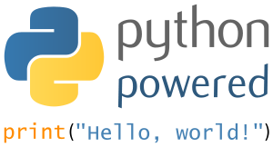

# Python 3 教程

## 题目描述
我们可以在命令窗口(Windows 使用 win+R 调出 cmd 运行框)使用以下命令查看我们使用的 Python 版本：
```

python -V
或
python --version

```
以上命令执行结果如下：
```

Python 3.3.2

```
你也可以进入Python的交互式编程模式，查看版本：
```

Python 3.3.2 (v3.3.2:d047928ae3f6, May 16 2013, 00:03:43) [MSC v.1600 32 bit (Intel)] on win32
Type "copyright", "credits" or "license()" for more information.
>>> 

```
对于大多数程序语言，第一个入门编程代码便是"Hello World！"，以下代码为使用 Python 输出"Hello World！"：

## 示例图片


## hello.py 文件代码：
### 代码
```python
#!/usr/bin/python3
 print("Hello, World!")
```
### 输出结果
```

$ python3 hello.py

```
源链接: [https://www.runoob.com//www.runoob.com/python3/python3-tutorial.html](https://www.runoob.com//www.runoob.com/python3/python3-tutorial.html)